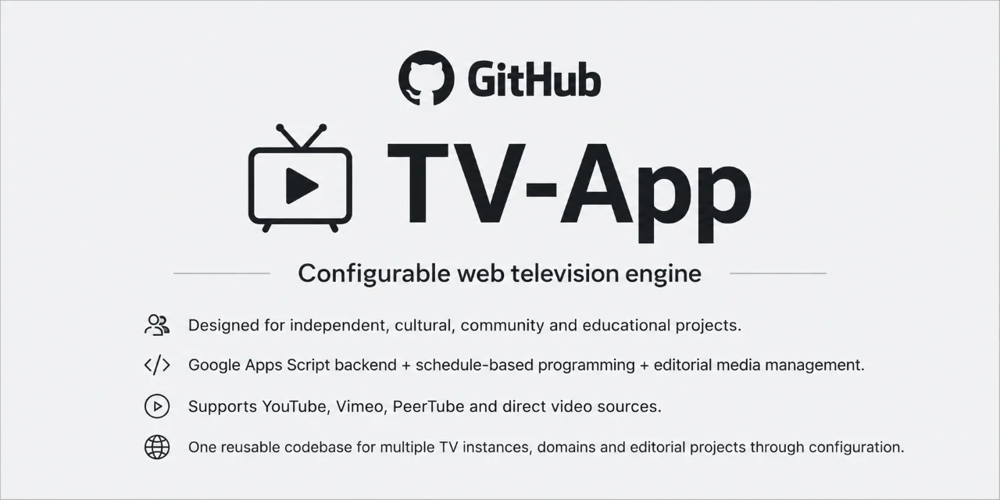

# TV App

**TV App** is a configurable and reusable television platform designed for independent, cultural, community, and educational projects.

It combines a Google Apps Script backend with schedule-based programming, editorial media management, and multiple playback clients. The browser client supports YouTube, Vimeo, PeerTube, and direct video sources; a native Android TV / Google TV client is now being developed against the same instance and feed contract.

The same engine can power multiple TV instances, domains, editorial projects, and client surfaces without modifying application code.

> **One instance, one schedule, multiple clients.**

## One configuration per TV

Instance customization lives in a single `app.config.json` file. It can define:

- instance name, language, locale and timezone;
- public site and feed URLs;
- branding, logos, favicons and application icons;
- SEO, Open Graph, Twitter and structured metadata;
- publisher information;
- navigation links;
- interface labels and editorial copy;
- participation and moderation form links;
- analytics integration;
- backend menu/database names and status vocabulary;
- entity integration defaults;
- supported providers;
- deployment domain / CNAME.

The generic reference is [`web/config.example.json`](web/config.example.json).

Archipiélago Vivo is kept only as the first example preset under [`presets/archipielago-vivo/`](presets/archipielago-vivo/). The generic engine does not depend on that preset.

## Clients

TV App clients consume the same instance configuration and public TV feed rather than maintaining separate editorial databases.

```text
TV App
├── web/                  browser client
└── clients/
    └── android-tv/       native Android TV / Google TV client
```

The Android TV client foundation uses Compose for TV, Media3 ExoPlayer, MediaSession, deep links and Android TV home-screen channels. See [`docs/MULTIPLATFORM.md`](docs/MULTIPLATFORM.md) and [`clients/android-tv/README.md`](clients/android-tv/README.md).

## Build an instance

```bash
node scripts/build-instance.js presets/archipielago-vivo/app.config.json
```

The builder creates:

```text
dist/<instance_id>/
├── web/
│   ├── config.json
│   ├── index.html
│   ├── runtime-config.js
│   ├── app.js
│   ├── tv-engine.js
│   ├── tv-player.js
│   ├── robots.txt
│   ├── sitemap.xml
│   ├── site.webmanifest
│   └── assets/
└── apps-script/
    ├── 00_Instance_Config.gs
    ├── 00_Config.gs
    ├── ...
    └── appsscript.json
```

The build process generates static SEO/deployment metadata for crawlers and generates the Apps Script instance configuration from the **same JSON source** used by the browser client.

Android TV packaging will consume the same generated instance contract rather than introducing a second configuration format.

## Repository structure

```text
apps-script/          reusable Google Apps Script backend
web/                  reusable browser client
clients/android-tv/   native Android TV / Google TV client
presets/              instance configuration and assets
scripts/              build and validation tooling
docs/                 architecture and deployment documentation
```

## License

TV App is free software licensed under the **GNU Affero General Public License v3.0 (AGPL-3.0)**.

See [LICENSE](LICENSE) for details.
